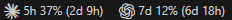
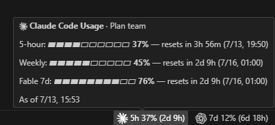
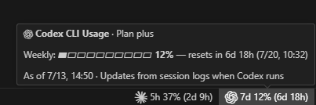

# Claude Code Usage & Codex Usage Monitor

Claude usage & Codex usage monitor for your status bar — track Claude Code and OpenAI Codex CLI rate limits side by side in VS Code, Cursor, Windsurf, and VSCodium, with 5-hour and weekly quotas, reset times, and alerts.

[VS Code Marketplace](https://marketplace.visualstudio.com/items?itemName=jjju.claude-codex-usage-monitor) · [Open VSX for Cursor and VSCodium](https://open-vsx.org/extension/jjju/claude-codex-usage-monitor) · [Windsurf Marketplace](https://marketplace.windsurf.com/extension/jjju/claude-codex-usage-monitor) · [Leave an honest review](https://marketplace.visualstudio.com/items?itemName=jjju.claude-codex-usage-monitor&ssr=false#review-details)

Hover any item for a full breakdown:

## Install

- VS Code: install from the [VS Code Marketplace](https://marketplace.visualstudio.com/items?itemName=jjju.claude-codex-usage-monitor)
- Cursor and VSCodium: install from [Open VSX](https://open-vsx.org/extension/jjju/claude-codex-usage-monitor)
- Windsurf: install from the [Windsurf Marketplace](https://marketplace.windsurf.com/extension/jjju/claude-codex-usage-monitor) after the Open VSX listing is synchronized
- Manual installation: download the VSIX from [GitHub Releases](https://github.com/jun1485/claude-codex-usage/releases/latest)

## What you see

- Claude: `✳ 5h 7% (3h 12m)` — 5-hour window usage + time until its reset
- Codex: `⬡ 7d 12% (6d 1h)` — weekly window usage + time until reset
- Full mode: `5h 7% (3h 12m) · 7d 41% (2d 5h)` — each usage window + its reset time
- Hover for details: 5-hour / weekly / per-model usage bars, reset times, and plan
- Background turns orange at 80% usage and red at 95% (thresholds configurable)
- Click for a quick menu: toggle Claude/Codex on or off, open settings, or refresh

## Data sources

| Tool        | Source                                                                | How                                                                                                  |
| ----------- | --------------------------------------------------------------------- | ---------------------------------------------------------------------------------------------------- |
| Claude Code | OAuth token from `~/.claude/.credentials.json` or the macOS Keychain | Queries an Anthropic-hosted, undocumented usage endpoint (every 60s while the window is focused, configurable) |
| Codex CLI   | Session logs in `~/.codex/sessions/**/*.jsonl`                        | Parses the latest `rate_limits` event (updates instantly via file watching)                          |

Tokens and usage data stay on your machine. The extension has no telemetry or owned server; Claude usage requests go only to the Anthropic-hosted endpoint.

If the extension helps your workflow, an honest Marketplace review is welcome. Reviews are never rewarded or incentivized.

## Settings

| Setting                                   | Default   | Description                                        |
| ----------------------------------------- | --------- | -------------------------------------------------- |
| `claudeCodexUsage.refreshIntervalSeconds` | `60`      | Refresh interval in seconds                        |
| `claudeCodexUsage.displayMode`            | `compact` | `compact`: 5-hour usage only / `full`: all windows |
| `claudeCodexUsage.warningThreshold`       | `80`      | Orange warning background threshold (%)            |
| `claudeCodexUsage.errorThreshold`         | `95`      | Red error background threshold (%)                 |
| `claudeCodexUsage.claude.enabled`         | `true`    | Show Claude usage                                  |
| `claudeCodexUsage.codex.enabled`          | `true`    | Show Codex usage                                   |
| `claudeCodexUsage.claude.credentialsPath` | `""`      | Override Claude credentials file path              |
| `claudeCodexUsage.codex.sessionsPath`     | `""`      | Override Codex sessions directory                  |

## Requirements

- Logged in to Claude Code (run `claude`, then `/login`)
- Codex CLI usage history (session logs must exist for Codex data to appear)

## Known limitations

- If the Claude token has expired, running Claude Code once renews it automatically.
- The Anthropic-hosted usage endpoint is undocumented and may change without notice.
- Codex usage comes from session logs, so new data appears only when Codex runs (changes are picked up immediately). Windows whose reset time has already passed are shown as 0%.
- A status bar item is hidden automatically when its tool is not detected (no `~/.claude` directory, or no `~/.codex/sessions` directory). It appears once the tool is used.
- Refresh pauses while the window is unfocused and resumes (with an immediate refresh) on focus.

## Localization

English by default; Korean (한국어) and Chinese (简体中文 / 繁體中文) UI when the VS Code display language matches.
